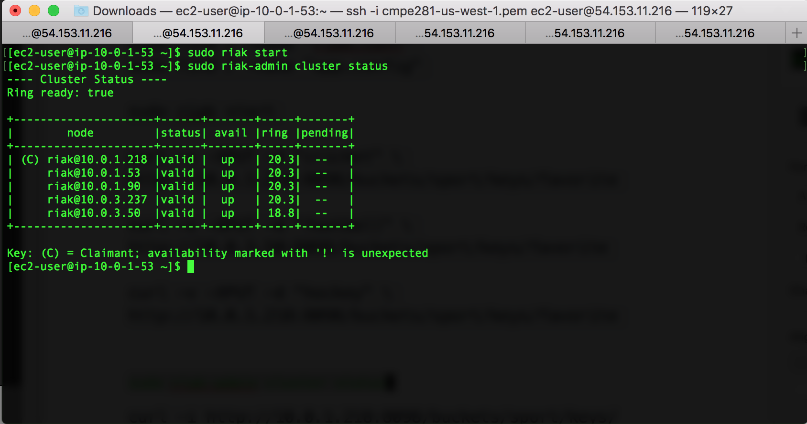
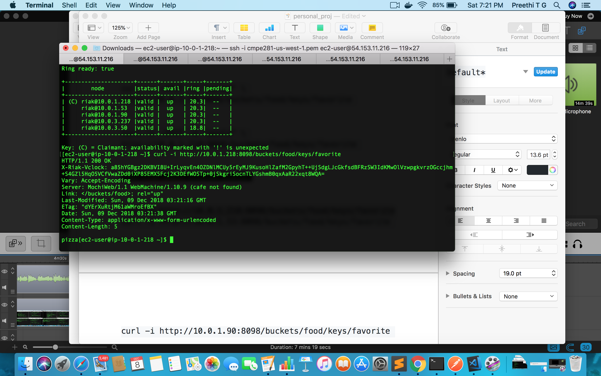

# Week 1

CAP Theorem

There are three key concepts that has to be balanced while choosing a data management system 

1.Consistency : Every node sees the same data at the same time ie, read from nodes will return the most recent write. 

2.Availability : Availability means that the system should be operational 100% of the time. Every request gets a response  from the node, recent or stale.

3.Partition Tolerance : Partiton Tolerance means that the system should function despite network failure. 

CAP theorem states that distributed data system can only have 2 out of 3: Consistency, Availability, Partition Tolerance[1]. Network partition is not an option, it is a situation that has to be faced. Thus, under network partition, we have to choose between Consistency and Availability based on our usecase.

CP - Under network failure, CP systems try to make the system consistent rather than available. Every transaction should go from one consistent state to another consistent state. It waits for a response from the partitioned node and under timeout, it either makes it unavailable, or throw an error. Once the network partition is resolved, it makes the system available with the most recent data all over the nodes.

Example - MongoDB

	MongoDB chooses to be consistent under network partition. It is an open source document oriented NoSQL system.

AP - Under network partition, AP systems make the system available and give either recent or stale data. It also accepts write during this phase. After network partition recovery, the system resolves all the inconsistent data becomes eventually consistent and gives most recent data in all the nodes.

Example - Riak

	Riak is a NoSQL system with key-value data model. It offers fault tolerant availability. It offers HTTP operations such as GET, PUT, POST, DELETE data manipulation. 

<b>Understand concepts of Riak DB, keywords such as Buckets, Ring, R, W, n_val etc</b>
https://github.com/basho-labs/little_riak_book/blob/master/en/02-concepts.md

<b>To get overview of HTTP operations that can be performed for Riak</b>
http://docs.basho.com/riak/kv/2.2.3/developing/api/http/

<b>MongodB documentation - Install Mongo on Amazon</b>
https://docs.mongodb.com/manual/tutorial/install-mongodb-on-amazon/

<b>Deploy a Highly-Available MongoDB Replica Set on AWS</b>
https://eladnava.com/deploy-a-highly-available-mongodb-replica-set-on-aws/

<h3>Other References:</h3>
<pre>
[1]https://towardsdatascience.com/cap-theorem-and-distributed-database-management-systems-5c2be977950e
[2]http://blog.nahurst.com/visual-guide-to-nosql-systems
[3]http://robertgreiner.com/2014/08/cap-theorem-revisited/
[4]https://queue.acm.org/detail.cfm?id=1394128
[5]https://echidna.co/blog/scalable-commerce-nosql-databases/
</pre>

<h2>Summary</h2>
<pre>
	Got an understanding of CAP theorem
	Got an understanding of MongoDB and its CP properties under network partition
	Got an understanding of Riak and its AP properties under network partition
</pre>

# Week 2

## Task 1 - Setup Riak cluster and use dummy value to test for partition

In order to create a network partition on a later stage, I created a private subnet in my "cmpe281" VPC. The private subnet the got automatically generated with VPC creation was for Availability Zone (AZ) us-west-1c. Thus I created my new private subnet in AZ us-west-1a. 
	
	Goto AWS Console. Under Networking & Content Delivery, click on VPC
	From VPC dashboard choose Subnets
	Create Subnet

	Name tag: Private subnet_az_a
	VPC : cmpe281
	Availability Zone: us-west-1a
	IPv4 CIDR block : 10.0.3.0/24

	Create

After this step, I had 2 private subnets
	
	Private subnet : 10.0.1.0/24 : us-west-1c
	Private subnet_az_a : 10.0.3.0/24 : us-west-1a

Next I went through Riak Documentation to understand the ports that has to be opened for inter-node communication within cluster

	http://docs.basho.com/riak/kv/2.2.3/setup/installing/amazon-web-services/

According to the documentation, I created a Riak Security Group in AWS

	Goto AWS Console. Under Compute click on EC2
	From EC2 dashboard choose Security Groups under NETWORK & SECURITY
	Create Security Group

	Security group name : Riak Personal Project
	Description : Riak Personal Project
	VPC : cmpe281

	In Inbound Security group rules, Add new rules

	Port Range : 8099 ; Source : 0.0.0.0/0, ::/0
	Port Range : 8087 ; Source : 0.0.0.0/0, ::/0
	Port Range : 22 ; Source : 0.0.0.0/0, ::/0
	Port Range : 4369 ; Source : <Your security group ID>
	Port Range : 8098 ; Source : <Your security group ID>
	Port Range : 6000 - 7999 ; Source : <Your security group ID>

	Create

Now with this rule, any node in the same security group can communicate with each other.
Next create 5 Riak instances. I created 3 in AZ us-west-1c and 2 in AZ us-west-1a

	Goto AWS Console. Under Compute click in EC2
	From EC2 dashboard choose Instances
	Launch instance

	AMI : Riak KV 2.2 Series
	Type: t2.micro
	Network : vpc - cmpe281
	Subnet : Choose private subnet in us-west-1c or us-west-1a
	Auto-assign Public IP : Disable
	Keep everything else as default in that page. Click Next

	Keep default storage
	No tags
	Configure Security Group
	Choose option : Select an existing security group
	Select Riak Personal Project
	Review and launch

Since all the instances are in private subnet, i created a jumpbox
	
	Goto AWS Console. Under Compute click in EC2
	From EC2 dashboard choose Instances
	Launch instance

	AMI : Amazon Linux AMI 2018.03.0 (HVM)
	Type: t2.micro
	Network : vpc - cmpe281
	Subnet : Public subnet
	Auto-assign Public IP : Enable
	Keep everything else as default in that page. Click Next

	Keep default storage
	No tags
	Configure Security Group
	Choose option : Select an existing security group
	Select cmpe281-dmz (Open Inbound ports 80,22,442)
	Review and launch

ssh into Jumpbox from terminal

	ssh -i <key> ec2-user@<ip address of Jumpbox>
	ssh -i cmpe281-us-west-1.pem ec2-user@13.57.254.158

Copy key file (.pem) into Jumpbox

	scp -i <key> <key> ec2-user@<ip address of Jumpbox> :/tmp
	mv /tmp/<key> . 

From Jumpbox, ssh into all the 5 private riak instances
	
	Riak1 - ssh -i cmpe281-us-west-1.pem ec2-user@10.0.1.218
	Riak2 - ssh -i cmpe281-us-west-1.pem ec2-user@10.0.1.53
	Riak3 - ssh -i cmpe281-us-west-1.pem ec2-user@10.0.1.90
	Riak4 - ssh -i cmpe281-us-west-1.pem ec2-user@10.0.3.50
	Riak5 - ssh -i cmpe281-us-west-1.pem ec2-user@10.0.3.237

Update and Start riak in all the nodes

	sudo yum update
	sudo riak start

Use one node to join the cluster

	sudo riak-admin cluster join riak@10.0.1.218

The nodes were unreachable. Then I searched through Riak documentation and found that we have to change riak.conf and app.config file for successful inter-node communication.

	http://docs.basho.com/riak/kv/2.2.3/using/security/

Change riak.conf

	sudo find / -name "riak.conf"
	Add the following in riak.conf
		erlang.distribution.port_range.minimum = 6000
		erlang.distribution.port_range.maximum = 7999

Change app.config

	sudo find / -name "app.config"
	Add the follwing in the beginning of app.config file
		{ kernel, 
		 [
		  {inet_dist_listen_min, 6000},
		  {inet_dist_listen_max, 7999}
		]}

These steps will become effective once you stop riak and start again. 
Perform **sudo riak-admin cluster join riak@10.0.1.218** from all the instances. After this step, the node will be in joining state. Status of the cluster or member status can be inspected using following instructions

	sudo riak-admin cluster status
	sudo riak-admin member_status

From the node chosen to join the cluster, perform the following to plan and commit the cluster

	sudo riak-admin cluster plan
	sudo riak-admin cluster commit
	

This will take few moments to make all the nodes in the cluster valid. To remove a node from a cluster, perform the follwing from the node that has to be removed
	
	sudo riak-admin cluster leave riak@<ip address of the node which was choosen to join>

First I tested whether the nodes are able to talk with each other. So i created a bucket "food" with simple key "favorite" for value "pizza"

	curl -v -XPUT -d "pizza" \
    http://10.0.1.218:8098/buckets/food/keys/favorite
    

The curl can be tested with the following curl command
	
	curl -i http://<ip address of riak node>:8098/buckets/food/keys/favorite
		

The test was successfull and I got "pizza" from all the nodes. 
Next task was to create a test network partition. The inter-node communication error I got in the past gave me the idea to change the security rule such the nodes in one private subnet cannot talk with nodes in another subnet

	Goto AWS Console. Under Compute click on EC2
	From EC2 dashboard choose Security Groups under NETWORK & SECURITY
	Change Security Group : Riak Personal Project

	Port Range : 8099 ; Source : 10.0.1.0/24
	Port Range : 8087 ; Source : 10.0.1.0/24
	Port Range : 22 ; Source : 0.0.0.0/0, ::/0
	Port Range : 4369 ; Source : 10.0.1.0/24 (IPv4 CIDR block for Private subnet in AZ us-west-1c)
	Port Range : 8098 ; Source : 10.0.1.0/24, 10.0.0.0/24 (IPv4 CIDR block for Private subnet in AZ us-west-1c)
	Port Range : 6000 - 7999 ; Source : 10.0.1.0/24 (IPv4 CIDR block for Private subnet in AZ us-west-1c)

	Create a new Security group

	Goto AWS Console. Under Compute click on EC2
	From EC2 dashboard choose Security Groups under NETWORK & SECURITY
	Create Security Group

	Security group name : Riak Personal Project SG2
	Description : Riak Personal Project SG2
	VPC : cmpe281

	In Inbound Security group rules, Add new rules

	Port Range : 8099 ; Source : 10.0.3.0/24
	Port Range : 8087 ; Source : 10.0.3.0/24
	Port Range : 22 ; Source : 0.0.0.0/0, ::/0
	Port Range : 4369 ; Source : 10.0.3.0/24 (IPv4 CIDR block for Private subnet in AZ us-west-1a)
	Port Range : 8098 ; Source : 10.0.3.0/24, 10.0.0.0/24 (IPv4 CIDR block for Private subnet in AZ us-west-1a)
	Port Range : 6000 - 7999 ; Source : 10.0.3.0/24 (IPv4 CIDR block for Private subnet in AZ us-west-1a)

	Create

I changed the security groups of all riak instances in AZ us-west-1c to Riak Personal Project and riak instances in AZ us-west-1a to Riak Personal Project SG2. Thus only instances in the same subnet can talk with each other. I stopped and started my riak nodes again. Upon performing sudo riak-admin cluster status from Riak1 I could see that Riak4 and Riak5 nodes were down. 

I updated the value for key favorite to "salad" from Riak1.

	curl -v -XPUT -d "salad" \
    http://10.0.1.218:8098/buckets/food/keys/favorite

Upon GET, I got favorite as "salad" from Riak1, Riak2 and Riak3 as they were all in same subnet. Riak4 and Riak5 showed me stale data, it showed "pizza" as favorite. 

Next, to check how nodes choose the latest data, I changed the value for favorite as "pasta" from Riak4. Since it was an AP system , Riak4 and Riak5 were available for write. 

	curl -v -XPUT -d "pasta" \
    http://10.0.3.50:8098/buckets/food/keys/favorite
    
 

Upon GET, I got favorite as "pasta" from Riak4 and Riak5 as they were in same subnet and were able to communicate with each other. Riak1, Riak2 and Riak3 still showed "salad". 

Now I closed the partition by changing both security group rules to:

	Port Range : 8099 ; Source : 10.0.3.0/24 , 10.0.1.0/24
	Port Range : 8087 ; Source : 10.0.3.0/24 , 10.0.1.0/24
	Port Range : 22 ; Source : 0.0.0.0/0, ::/0
	Port Range : 4369 ; Source : 10.0.3.0/24 , 10.0.1.0/24
	Port Range : 8098 ; Source : 10.0.3.0/24 , 10.0.1.0/24, 10.0.0.0/24
	Port Range : 6000 - 7999 ; Source : 10.0.3.0/24 , 10.0.1.0/24

After this change, **curl -i http://<ip_address_of_riak_node>:8098/buckets/food/keys/favorite** gave me "pasta" in all the nodes. Thus, during network partition recovery, all the nodes took the latest key for favorite ie, the last write and became consistent in their answers.

**Riak DB Design Diagram**

### Challenges Faced

- Understand ports that has to be opened for inter-node communication and the uses for the same.
- Riak nodes were unreachable without changing the riak.conf and app.config files. 

## Task 2 - Testing VPC Peering

As Professor told us to use VPC Peering for our Team Project for connecting multiple VPCs together, I researched about VPC Peering and tried using that for Personal Project. VPC Peering is a network connection between multiple VPCs across region which enables to route traffic between them using Private IPv4 addresses. AWS allows VPC peering with VPCs in same account or in another AWS account. 

References

	https://docs.aws.amazon.com/vpc/latest/peering/what-is-vpc-peering.html
	https://docs.aws.amazon.com/vpc/latest/peering/vpc-peering-basics.html
	https://docs.aws.amazon.com/vpc/latest/peering/vpc-peering-routing.html
	https://docs.aws.amazon.com/vpc/latest/peering/vpc-peering-basics.html#vpc-peering-limitations

After going through the references, I started to work on my VPC peering connection. From the VPC Peering Limitation, I understood that AWS blocks VPC Peering with overlapping IPv4 CIDR blocks. So I created two VPCs with IPv4 CIDR blocks 11.0.0.0/16 and 12.0.0.0/16. Iam creating VPCs in same region.

	In AWS Management Console, Click on VPC under Networking & Content Delivery.
	Use Launch VPC Wizard from VPC dashboard to create a new VPC

	VPC #1

	Select VPC with Private and Public Subnets as we need both type of subnets for the project.
	IPv4 CIDR block: 11.0.0.0/16
	VPC name: cmpe281-personal-project-1
	Public subnet's IPv4 CIDR: 11.0.0.0/24
	Availability Zone: No Preference
	Private subnet's IPv4 CIDR: 11.0.1.0/24
	Availability Zone: No Preference

	Click on "Use a NAT instance instead" option to create a NAT instance with free tier limit.
	Instance type: t2.micro
	Key pair name: cmpe281-us-west-1

	Keep the rest as default and click in Create VPC.

	VPC #2
	
	Select VPC with Private and Public Subnets as we need both type of subnets for the project.
	IPv4 CIDR block: 12.0.0.0/16
	VPC name: cmpe281-personal-project-peer
	Public subnet's IPv4 CIDR: 12.0.0.0/24
	Availability Zone: No Preference
	Private subnet's IPv4 CIDR: 12.0.1.0/24
	Availability Zone: No Preference

	Click on "Use a NAT instance instead" option to create a NAT instance with free tier limit.
	Instance type: t2.micro
	Key pair name: cmpe281-us-west-1

	Keep the rest as default and click in Create VPC.

Create VPC Peering

	To create a VPC peering connection, choose Peering Connection from VPC Dashboard.
	Click on Create Peering Connection.

	Peering connection name tag : Personal Project
	VPC (Requester) : cmpe281-personal-project-1
	Account : My Account
	Region : This region (us-west-1)
	VPC (Accepter) : cmpe281-personal-project-peer
	Create Peering Connection.

A VPC peering comes to effect only if both the Accepter VPC accepts the Peering Connection instantiated by Requester VPC. 

	To accept VPC peering, Goto Peering Connection from VPC Dashboard.
	Select the new peering connection and Click on Actions -> Accept Request.

This creates a Peering Connection tag. Only creating a VPC peering connection will not enable traffic between the instances in VPCs. We have to change the routing table of the various subnets involved in the peering connection to accept traffic from other VPC CIDR blocks. From the above VPC creation, we have a Public subnet and a Private subnet in each VPC. The MongoDB cluster which has to created as part of the personal project will reside in the private subnets of these 2 VPCs. Therefore, we have to change the routing tables of all the 4 subnets involved to enable traffic routes from the private subnets in other VPC.

Goto VPC Dashboard and choose Route table option.
Add the following in the routing tables.

<b>cmpe281-personal-project-peer : Public and Private subnets</b>
	
	Destination: 11.0.0.0/16. (CIDR block of VPC 1)
	Target : pcx-********* (Peering Connection tag)

<b>cmpe281-personal-project-1 : Public and Private subnets</b>	

	Destination: 12.0.0.0/16. (CIDR block of VPC 1)
	Target : pcx-********* (Peering Connection tag)

After the routing tables are changed, create a public instance (jumpbox) and a private instance in each VPC.

<b>Configuration of Public instances</b>

	Goto AWS Console. Under Compute click in EC2
	From EC2 dashboard choose Instances
	Launch instance

	AMI : Amazon Linux AMI 2018.03.0 (HVM)
	Type: t2.micro
	Network : cmpe281-personal-project-1 / cmpe281-personal-project-peer
	Subnet : Public subnet
	Auto-assign Public IP : Enable
	Keep everything else as default in that page. Click Next

	Keep default storage
	No tags
	Configure Security Group
	Choose option : Create a Security group
	Security group name : Jumpbox
	Description : SG for Jumbox
	VPC : cmpe281-personal-project-1 / cmpe281-personal-project-peer

	In Inbound Security group rules, Add new rules
	Type : SSH ; Port : 22 ; Source : Anywhere
	Type : HTTP ; Port : 80 ; Source : Anywhere
	Type : HTTPS ; Port : 443 ; Source : Anywhere

Initially, while creating private instances, I opened only SSH port and HTTP port for inbound traffic. But the private instances were not able to talk with each other. I went through some AWS documentation and youtube videos and found out that we have to enable "All ICMP - IPv4" from the other CIDR block of other private instance we want to connect with. Thus the final configuration for private instances are:

<b>Configuration of Private instances</b>

	Goto AWS Console. Under Compute click in EC2
	From EC2 dashboard choose Instances
	Launch instance

	AMI : Amazon Linux AMI 2018.03.0 (HVM)
	Type: t2.micro
	Network : cmpe281-personal-project-1 / cmpe281-personal-project-peer
	Subnet : Private subnet
	Auto-assign Public IP : Disable

	Keep default storage
	No tags
	Configure Security Group
	Choose option : Create a Security group
	Security group name : Private-SG
	Description : SG for private instances
	VPC : cmpe281-personal-project-1 / cmpe281-personal-project-peer

	For security group in cmpe281-personal-project-1,
	In Inbound Security group rules, Add new rules
	Type : SSH ; Port : 22 ; Source : 11.0.0.0/16 , 12.0.0.0/16
	Type : All ICMP - IPv4 ; Source : 12.0.1.0/24

	For security group in cmpe281-personal-project-peer,
	In Inbound Security group rules, Add new rules
	Type : SSH ; Port : 22 ; Source : 11.0.0.0/16 , 12.0.0.0/16
	Type : All ICMP - IPv4 ; Source : 11.0.1.0/24	

After creating instances, ssh into both the jumpbox public instances

	ssh -i cmpe281-us-west-1.pem ec2-user@54.153.127.96
	ssh -i cmpe281-us-west-1.pem ec2-user@52.53.125.40

In order to connect to private instances, move the key-pair to jumpbox

	scp -i cmpe281-us-west-1.pem cmpe281-us-west-1.pem ec2-user@<public IP>:/tmp
	mv /tmp/cmpe281-us-west-1.pem .

Connect to respective private instances

	ssh -i cmpe281-us-west-1.pem ec2-user@11.0.1.156
	ssh -i cmpe281-us-west-1.pem ec2-user@12.0.1.160

From one private instance, ping the other private instance to check if the private instances from both VPCs are able to talk with each other

	ping 11.0.1.156
	ping 12.0.1.160

<h2>Summary</h2>

	Setup Riak cluster and performed network partitioning to test the Partition Tolerance of AP system
	Setup VPC peering connection to use the same to test the Partition Tolerance of CP system next week.

# Week 3

## Task 2 - CP partition tolerance - MongoDB

MongoDB is a CP system. ie, under network partition, MongoDB will be partition tolerant and chooses consistency over availability.

For testing the Partition Tolerance of MongoDB, I created a cluster of 5 nodes using the mongo-ami that was created as part of Lab4. Out of the 5 nodes, 3 nodes were created in VPC cmpe281-personal-project-1 (AZ us-west-1c) and 2 nodes in VPC cmpe281-personal-project-peer (AZ us-west-1a). The two VPCs are connected with each other using VPC peering connection (Demonstrated in Week 2). 

I have used the same jumpbox I created in Week 2 (for VPC peering test) to connect with the private mongo instances. MongoDB uses port 27017 for communication. So I changed the security group "Private-SG" for both the VPCs to add new inbound rule for mongo communication.

	Goto AWS Console. Under Compute click in EC2
	From EC2 dashboard choose Security Groups
	Click on "Private-SG" under VPC cmpe281-personal-project-1 / VPC cmpe281-personal-project-peer

	Click on Actions->Edit inbound rules . Add the follwing in each Security group
	Port range : 27017 ; Source : 11.0.1.0/24 , 12.0.1.0/24

These changes will help mongo nodes to communicate with each other. Next create 5 private instance, 3 in VPC cmpe281-personal-project-1  and 2 in VPC cmpe281-personal-project-peer.

	Goto AWS Console. Under Compute click in EC2
	From EC2 dashboard choose Instances
	Launch instance

	Goto My AMIs. Select mongo-ami (Created in Lab4)
	Type: t2.micro
	Network : cmpe281-personal-project-1 / cmpe281-personal-project-peer
	Subnet : Private subnet
	Auto-assign Public IP : Disable

	Keep default storage
	No tags
	Configure Security Group
	Select an existing Security Group : Private-SG
	Review and Launch

After this step, I had 5 private instances:

	11.0.1.234 mongo_1
	11.0.1.29 mongo_2
	11.0.1.106 mongo_3
	12.0.1.177 mongo_4
	12.0.1.75 mongo_5

ssh into jumpbox in different VPCs to access the respective private instances. 

	ssh -i cmpe281-us-west-1.pem ec2-user@<public IP of Jumpbox>

As the jumpbox already has the key-pair (moved during VPC peering test), we can directly connect to private mongo instances

	ssh -i cmpe281-us-west-1.pem ubuntu@11.0.1.234   //Jumpbox(cmpe281-personal-project-1)
	ssh -i cmpe281-us-west-1.pem ubuntu@11.0.1.29   //Jumpbox(cmpe281-personal-project-1)
	ssh -i cmpe281-us-west-1.pem ubuntu@11.0.1.106   //Jumpbox(cmpe281-personal-project-1)
	ssh -i cmpe281-us-west-1.pem ubuntu@12.0.1.177   //Jumpbox(cmpe281-personal-project-peer)
	ssh -i cmpe281-us-west-1.pem ubuntu@12.0.1.75   //Jumpbox(cmpe281-personal-project-peer)

Inorder to avoid confusion and for easy readability, I changed the hostname of the mongo instances to mongo_1, mongo_2, mongo_3, mongo_4 and mongo_5

	sudo hostnamectl set-hostname <hostname>
	sudo reboot

The mongo-ami created during Lab4 was configured to create a replicaSet with name "cmpe281". Thus to initiate the replica set, select any one of the mongo instances and perform the following.

	mongo
	rs.initiate( {
   		_id : "cmpe281",
	         members: [
	              { _id: 0, host: "11.0.1.234:27017" },
	              { _id: 1, host: "11.0.1.29:27017" },
	              { _id: 2, host: "11.0.1.106:27017" },
	              { _id: 3, host: "12.0.1.177:27017" },
	              { _id: 4, host: "12.0.1.75:27017" },
	           ]
	})

After initiation, the nodes decide and elect one instance as Master /Primary. Writes can be done only to Primary node. 

	In order to check which node is primary, type
	rs.status()

rs.status() is very useful in understanding which nodes are Primary and Secondary. Its also useful in understanding the health condition of the nodes, whether it is reachable or not.

After the initiation, mongo_1 was elected as Primary node. The default MongoDB configuration is open for anyone to access the databases. Thus I created an admin user from mongo_1 to access the database.

	mongo
	use admin
	db.createUser( {
		user: <username>,
		pwd: <password>,
		roles: [{ role: "root", db: "admin" }]
	}); 

After this, login to nodes as Admin

	mongo -u <username> -p <password> --authenticationDatabase admin

Inorder to test for partition tolerance, create a db "personal_proj" and a collection "personal_proj" from Primary

	use personal_proj

	db.personal_proj.insert({
	    "name" : "Preethi",
	    "birth" : ISODate("1994-08-10T05:00:00Z"),
	    "country" : "India",
	    "joined" : "Spring 2018"
	})

	db.personal_proj.find()

In order to test if the data has been successfully replicated in secondary nodes, we have to allow query from secondary/replica nodes.

	rs.slaveOk()
	use personal_proj
	db.personal_proj.find()

The data was replicated correctly and all secondary nodes showed record for "Preethi". Next i created a network partition by deleting the VPC peering connection.

	In AWS Management Console, Click on VPC under Networking & Content Delivery.
	Choose Peering Connection from VPC Dashboard.
	Select "Personal Project" and Delete the connection.

Deleting the Peering connection disconnects the private instances from one VPC with the other. Thus mongo_4 and mongo_5 becomes unreachable from mongo_1, mongo_2 and mongo_3. The new primary may or maynot change. After the Peering connection is deleted, check the status of the replica set.

	Login to mongo_1 as admin and check rs.status()
	mongo -u <username> -p <password> --authenticationDatabase admin
	rs.status()

mongo_1 still remained the "Master"/Primary node. Upon rs.status(), I could see that mongo_4 and mongo_5 were unreachable as they both belong to VPC cmpe281-personal-project-peer. Upong checking the status from mongo_4 , I could see that mongo_1, mongo_2 and mongo_3 were unreachable from mongo_4. mongo_5 was still reachable to mongo_4 as they are in one VPC.

MongoDB follows Master-Slave configuration. Any writes has to be done to Master node. I inserted a new record in personal_proj collection from Primary node.

	use personal_proj
	
	db.personal_proj.insert({
	    "name" : "Anitha",
	    "birth" : ISODate("1986-10-01T05:00:00Z"),
	    "country" : "India",
	    "joined" : "Fall 2012"
	}) 

	db.personal_proj.find()

find() showed the records for "Preethi" and "Anitha" as expected. As mongo_1 (Primary) can reach to mongo_2 and mongo_3, the new record got replicated in both the systems. Since mongo_4 and mongo_5 were unreachable from Primary node, the record did not get replicated and db.personal_proj.find() gave a stale data with just the record of "Preethi" from mongo_4 and mongo_5.

Since writes can be only done to Master node, there is no concept of "last write" in Mongo. Whatever is updated to Master node will get replicated in Slave node. Inorder to end the network partition, I created a new VPC peering connection between VPC cmpe281-personal-project-peer and cmpe281-personal-project-1.

	Choose Peering Connection from VPC Dashboard.
	Click on Create Peering Connection.

	Peering connection name tag : Personal Project
	VPC (Requester) : cmpe281-personal-project-1
	Account : My Account
	Region : This region (us-west-1)
	VPC (Accepter) : cmpe281-personal-project-peer
	Create Peering Connection.

	To accept VPC peering, Goto Peering Connection from VPC Dashboard.
	Select the new peering connection and Click on Actions -> Accept Request.

	Choose Route table option from VPC Dashboard to connect the instances of two VPCs.
	Add the following in the routing tables.

cmpe281-personal-project-peer : Public and Private subnets
	
	Destination: 11.0.0.0/16. (CIDR block of VPC 1)
	Target : pcx-********* (Peering Connection tag)

cmpe281-personal-project-1 : Public and Private subnets

	Destination: 12.0.0.0/16. (CIDR block of VPC 1)
	Target : pcx-********* (Peering Connection tag)

Creating Peering connection enabled the Master node to talk with all the Slave nodes. 

rs.status() from Primary node, mongo_4 and mongo_5 showed all the nodes as reachable and healthy. db.personal_proj.find() from mongo_4 showed the new record for "Anitha" along with "Preethi" and became consistent with the Primary node. Thus, under network partition, nodes unreachable to Primary node shows stale data. After partition recovery, the unreachable nodes becomes eventually consistent and shows the updated data.

**Mongo DB Design Diagram**

### Challenges Faced

- Understand the concept of VPC peering and related route table changes. Experimentation helped a to get a better understanding.

## Mongo CP system test
- How does the system function during normal mode (i.e. no partition)

	Mongo uses master-slave architecture for data replication. In Mongo, write takes place only in master or primary node and the data is replicated in all the secondary nodes. Thus, any data written to primary can be immediatly read from primary to get a quick and consistent value. Mongo does not allow read from secondary by default. Thus, to read from secondary, we have to perform rs.statusOk() command.
	
- What happens to the master node during a partition? 

	During a network partition or even while starting mongo after stopping it in aws, election of primary takes place. The new primary can be our old primary itself , or some other node. It's all decided in runtime. To check which node is master node, we can perform rs.statusOk() form any one of the mongo instances.
	
- Can stale data be read from a slave node during a partition?

	By default, read is allowed only from master or primary node in Mongo. Inorder to read data from secondary, we have to perform rs.slaveOk() command in secondary node. If data is inserted or updated from primary during partition, then with rs.slaveOk() command, we can read stale data from slave nodes.	

- What happens to the system during partition recovery?

	During partition recovery, the data from primary node gets replicated to the slave nodes which were unreachable till then. Thus, slave nodes become eventually consistent with the primary node.

## Riak AP system test

- How does the system function during normal mode (i.e. no partition)

	Riak uses peer to peer communication for data replication. Write and read can be done from any of the instances. Unlike mongodb, we dont have to explicitly perform rs.slaveOk() command to read data from nodes other than coordinator nodes.
Riak uses HTTP requests for database manipulation.

- What happens to the nodes during a partition? 

	During partition, the partitioned node will be unreachable from rest of the cluster, which can be found using sudo riak-admin cluster status. Since all the nodes are available for read and write, when a write takes place to a node, the value will be replicated in all the nodes that are peered to the written node. Rest of the nodes will then show stale data. 

- Can stale data be read from a node during a partition?

	Yes, stale data can be read from the nodes during a partition if data is updated in a node which is unreachable from the node from which we read.

- What happens to the system during partition recovery?

	During partition recovery, riak makes all the nodes consistent with the last written data "last write" as all the nodes are available for read and write. But, by mentioning few conditions, such as W=3, we can give a constraint that last write is only valid from a node who has minimum of 3 write votes. 

