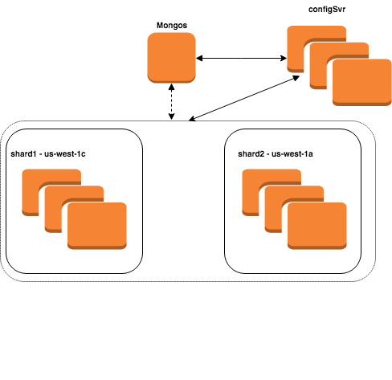

# Mongo Sharding

Main objective of sharding is horizontal scalability. Sharding helps in managing increased demand/work.  
There are 3 important components in sharding. 

<b>config servers</b>: Config servers store configuration details and meta data such as the information about the location of data shards. Config servers for shared cluster can be deployed as a replica set to increase availability and redundancy.

<b>mongos</b> : Mongos is a query router. It processess the queries from application layer, communicates with config server to figure out where the data is stored in sharded cluster and accesses and returns info from appropriate shards.

<b>shard</b>: Shard is the database server that contains subset of shared data.

### Mongo Ports

Mongos and MongoD - 27017

Shard server: 27018 

Config server: 27019 

## EC2 instances

* jumpbox - To access and use private instances.
* config server cluster with 3 replicas, 2 in AZ us-west-1c and 1 in AZ us-west-1a.
* shard1 cluster with 3 replicas all in AZ us-west-1c
* shard2 cluster with 3 replicas all in AZ us-west-1a
* mongos instance.

## Design

## Setup

### Configuration of Public instance

First I created a Jumpbox (public instance) which will be used to access and ssh into all the private mongo instances.
	
	Goto AWS Console. Under Compute click in EC2
	From EC2 dashboard choose Instances
	Launch instance

	AMI : Amazon Linux AMI 2018.03.0 (HVM)
	Type: t2.micro
	Network : cmpe281
	Subnet : Public subnet
	Auto-assign Public IP : Enable
	Keep everything else as default in that page. Click Next

	Keep default storage
	No tags
	Configure Security Group
	Security group name : cmpe281-dmz

	In Inbound Security group rules, Open ports are
	Type : SSH ; Port : 22 ; Source : Anywhere
	Type : HTTP ; Port : 80 ; Source : Anywhere
	Type : HTTPS ; Port : 443 ; Source : Anywhere

### Configuration of Mongo base AMI

I created a Mongo base ami with mongo 4.0 installed and MongoDB Keyfile created. This image will be used as a base for all the 10 mongo instances.

First I created a Security Group which will be attached to all the mongo instances for communication. I will be deploying my instances in two private subnets with CIDR block 10.0.1.0/24 and 10.0.3.0/24 

	Goto AWS Console. Under Compute click on EC2
	From EC2 dashboard choose Security Groups under NETWORK & SECURITY
	Create Security Group

	Security group name : Mongo Sharding SG
	Description : Mongo Sharding SG
	VPC : cmpe281

	In Inbound Security group rules, Add new rules

	Port Range : 22 ; Source : 0.0.0.0/0, ::/0
	Port Range : 27017 ; Source : 10.0.1.0/24 , 10.0.3.0/24 

Next, create an ubuntu instance for mongo base AMI.

	From EC2 dashboard choose Instances
	Launch instance

	AMI : Ubuntu Server 16.04 LTS (HVM)
	Type: t2.micro
	Network : cmpe281
	Subnet : Private subnet
	Auto-assign Public IP : Disable
	Keep everything else as default in that page. Click Next

	Keep default storage
	No tags
	Configure Security Group
	Security group name : Mongo Sharding SG
	Create

ssh into Mongo instance from jumpbox.

	ssh -i <key>.pem ec2-user@<public ip of Jumpbox>
	scp -i <key>.pem <key>.pem ec2-user@<public ip of Jumpbox>:/tmp
	mv /tmp/<key>.pem .
	ssh -i <key>.pem ubuntu@<private ip>

Install Mongo 4.0

    sudo apt-key adv --keyserver hkp://keyserver.ubuntu.com:80 --recv 9DA31620334BD75D9DCB49F368818C72E52529D4

    echo "deb [ arch=amd64,arm64 ] https://repo.mongodb.org/apt/ubuntu xenial/mongodb-org/4.0 multiverse" | sudo tee /etc/apt/sources.list.d/mongodb.list

    sudo apt update
    sudo apt install mongodb-org

Verify if mongo was successfully installed

    sudo systemctl enable mongod
    sudo systemctl start mongod
    mongod --version

Next, I created a MongoDB Keyfile which can be used for secured use of Mongo.

    openssl rand -base64 741 > keyFile
    sudo mkdir -p /opt/mongodb
    sudo cp keyFile /opt/mongodb
    sudo chown mongodb:mongodb /opt/mongodb/keyFile
    sudo chmod 0600 /opt/mongodb/keyFile 

After doing these steps, I created an AMI.

	Select the instance, Click on Actions -> Image -> Create Image
	Image name : mongo-base-ami-ubuntu
	Image description : mongo-base-ami-ubuntu
	Create image    

### Configuration of Config Server

I used the same instance which was used to create mongo base ami. For the config server, we have to first create a database directory.

	sudo mkdir -p /data/db
    sudo chown -R mongodb:mongodb /data/db

<b>Change mongod.conf - Config server</b>

	sudo vi /etc/mongod.conf

    1. Change dbpath
    	storage:
    		dbPath: /data/db

    2. Change network port to 27019 and replace bindIp with 0.0.0.0 (binds on all ips) 
        # network interfaces
        net:
            port: 27019
            bindIp: 0.0.0.0

    3. Uncomment security section & add key file

    	security:
        	keyFile: /opt/mongodb/keyFile

    4. Uncomment Replication section. Name Replica Set = configSrv
    	replication:
        	replSetName: configSrv

    5. Uncomment Sharding section. Give clusterRole.
    	sharding:
    		clusterRole: configsvr

<b>Create and Enable mongod.service</b>

    sudo vi /etc/systemd/system/mongod.service

	[Unit]
	    Description=High-performance, schema-free document-oriented database
	    After=network.target

	[Service]
	    User=mongodb
	    ExecStart=/usr/bin/mongod --quiet --config /etc/mongod.conf

	[Install]
	    WantedBy=multi-user.target

	Enable Mongo Service

    	sudo systemctl enable mongod.service

    Restart MongoDB to apply our changes

        sudo service mongod restart
        sudo service mongod status

<b>Create AMI</b>

After doing all the configurations necessary for config server, I created a config ami which can be used for creating all the replicas of config server cluster.

	Select the instance, Click on Actions -> Image -> Create Image
	Image name : mongo-config-ami-ubuntu
	Image description : mongo-config-ami-ubuntu
	Create image

<b>Create all the config server replica instances</b>

I created 2 new config server replica instances to form the replica set.

	From EC2 dashboard choose Instances
	Launch instance

	My AMI : mongo-config-ami-ubuntu
	Type: t2.micro
	Network : cmpe281
	Subnet : Private subnet
	Auto-assign Public IP : Disable
	Keep everything else as default in that page. Click Next

	Keep default storage
	No tags
	Configure Security Group
	Security group name : Mongo Sharding SG
	Create

After this step, I had 3 config server instance
	
	config-server-1c 10.0.1.78   (Private subnet 10.0.1.0/24, us-west-1c)
	config-server-2c 10.0.1.67	 (Private subnet 10.0.1.0/24, us-west-1c)     
	config-server-3a 10.0.3.202  (Private subnet 10.0.3.0/24, us-west-1a)

To initiate the replica set, ssh into any one of the private instance from jumpbox.

	ssh -i <key>.pem ubuntu@<private IP of config server instance>

    mongo -port 27019

	rs.initiate( {
	   _id : "configSrv",
	   configsvr : true,
	   members: [
	      { _id: 0, host: "10.0.1.78:27019" },
	      { _id: 1, host: "10.0.1.67:27019" },
	      { _id: 2, host: "10.0.3.202:27019" }
	   ]
	})

Verify if the replica set was initialized correctly and if the nodes are able to talk with each other.

    rs.status()

10.0.1.78 was choosen as Primary node. From Primary node, create admin database for authentication.
        
    use admin

    Create admin account.

	db.createUser( {
		user: "admin",
		pwd: "*****",
		roles: [{ role: "root", db: "admin" }]
	});  

Login instruction with authentication

	mongo -port 27019 -u admin -p ***** --authenticationDatabase admin

### Configuration of Shard Server - Shard1

Create an instance with mongo base ami.

	From EC2 dashboard choose Instances
	Launch instance

	My AMI : mongo-base-ami-ubuntu
	Type: t2.micro
	Network : cmpe281
	Subnet : Private subnet (AZ - us-west-1c)
	Auto-assign Public IP : Disable
	Keep everything else as default in that page. Click Next

	Keep default storage
	No tags
	Configure Security Group
	Security group name : Mongo Sharding SG
	Create

ssh into the instance from jumpbox.

	ssh -i <key>.pem ubuntu@<private IP of shard1 instance>

Create a database directory.

	sudo mkdir -p /data/db
    sudo chown -R mongodb:mongodb /data/db

<b>Change mongod.conf - Shard server - shard1</b>

	sudo vi /etc/mongod.conf

    1. Change dbpath
    	storage:
    		dbPath: /data/db

    2. Change network port to 27018 and replace bindIp with 0.0.0.0 (binds on all ips) 
        # network interfaces
        net:
            port: 27018
            bindIp: 0.0.0.0

    3. Uncomment security section & add key file

    	security:
        	keyFile: /opt/mongodb/keyFile

    4. Uncomment Replication section. Name Replica Set = shard1
    	replication:
        	replSetName: shard1

    5. Uncomment Sharding section. Give clusterRole.
    	sharding:
    		clusterRole: shardsvr   

<b>Create and Enable mongod.service</b>

    sudo vi /etc/systemd/system/mongod.service

	[Unit]
	    Description=High-performance, schema-free document-oriented database
	    After=network.target

	[Service]
	    User=mongodb
	    ExecStart=/usr/bin/mongod --quiet --config /etc/mongod.conf

	[Install]
	    WantedBy=multi-user.target

	Enable Mongo Service

    	sudo systemctl enable mongod.service

    Restart MongoDB to apply our changes

        sudo service mongod restart
        sudo service mongod status

<b>Create AMI</b>

After doing all the configurations necessary for shard server with replica set shard1, I created a shard1 ami which can be used for creating all the replicas of shard1 shard server cluster.

	Select the instance, Click on Actions -> Image -> Create Image
	Image name : mongo-1shard-ami-ubuntu
	Image description : mongo-1shard-ami-ubuntu
	Create image

<b>Create all the shard1 replica instances</b>

I created 2 new shard1 replica instances to form the replica set, all in AZ us-west-1c

	From EC2 dashboard choose Instances
	Launch instance

	My AMI : mongo-1shard-ami-ubuntu
	Type: t2.micro
	Network : cmpe281
	Subnet : Private subnet
	Auto-assign Public IP : Disable
	Keep everything else as default in that page. Click Next

	Keep default storage
	No tags
	Configure Security Group
	Security group name : Mongo Sharding SG
	Create

After this step, I had 3 config server instance
	
    shard1-replica1 10.0.1.178
    shard1-replica2 10.0.1.177
    shard1-replica3 10.0.1.49

To initiate the replica set, ssh into any one of the private instance (of shard1) from jumpbox.

	ssh -i <key>.pem ubuntu@<private IP of shard1 replica instance>

    mongo -port 27018

	rs.initiate( {
	   _id : "shard1",
		   members: [
		      { _id: 0, host: "10.0.1.178:27018" },
		      { _id: 1, host: "10.0.1.177:27018" },
		      { _id: 2, host: "10.0.1.49:27018" }
	   ]
	}) 

Verify if the replica set was initialized correctly and if the nodes are able to talk with each other.

    rs.status()

10.0.1.177 was choosen as Primary node. From Primary node, create admin database for authentication.
        
    use admin

    Create admin account.

	db.createUser( {
		user: "admin",
		pwd: "*****",
		roles: [{ role: "root", db: "admin" }]
	});  

Login instruction with authentication

	mongo -port 27018 -u admin -p ***** --authenticationDatabase admin

### Configuration of Shard Server - Shard2

Create an instance with mongo base ami.

	From EC2 dashboard choose Instances
	Launch instance

	My AMI : mongo-base-ami-ubuntu
	Type: t2.micro
	Network : cmpe281
	Subnet : Private subnet (AZ - us-west-1a)
	Auto-assign Public IP : Disable
	Keep everything else as default in that page. Click Next

	Keep default storage
	No tags
	Configure Security Group
	Security group name : Mongo Sharding SG
	Create

ssh into the instance from jumpbox.

	ssh -i <key>.pem ubuntu@<private IP of shard2 instance>

Create a database directory.

	sudo mkdir -p /data/db
    sudo chown -R mongodb:mongodb /data/db

<b>Change mongod.conf - Shard server - shard2</b>

	sudo vi /etc/mongod.conf

    1. Change dbpath
    	storage:
    		dbPath: /data/db

    2. Change network port to 27018 and replace bindIp with 0.0.0.0 (binds on all ips) 
        # network interfaces
        net:
            port: 27018
            bindIp: 0.0.0.0

    3. Uncomment security section & add key file

	    security:
	        keyFile: /opt/mongodb/keyFile

    4. Uncomment Replication section. Name Replica Set = shard2
    	replication:
        	replSetName: shard2

    5. Uncomment Sharding section. Give clusterRole.
    	sharding:
    		clusterRole: shardsvr   

<b>Create and Enable mongod.service</b>

    sudo vi /etc/systemd/system/mongod.service

	[Unit]
	    Description=High-performance, schema-free document-oriented database
	    After=network.target

	[Service]
	    User=mongodb
	    ExecStart=/usr/bin/mongod --quiet --config /etc/mongod.conf

	[Install]
	    WantedBy=multi-user.target

	Enable Mongo Service

    	sudo systemctl enable mongod.service

    Restart MongoDB to apply our changes

        sudo service mongod restart
        sudo service mongod status

<b>Create AMI</b>

After doing all the configurations necessary for shard server with replica set shard2, I created a shard2 ami which can be used for creating all the replicas of shard2 shard server cluster.

	Select the instance, Click on Actions -> Image -> Create Image
	Image name : mongo-shard1-ami-ubuntu
	Image description : mongo-shard1-ami-ubuntu
	Create image

<b>Create all the shard2 replica instances</b>

I created 2 new shard2 replica instances to form the replica set, all in AZ us-west-1c

	From EC2 dashboard choose Instances
	Launch instance

	My AMI : mongo-1shard-ami-ubuntu
	Type: t2.micro
	Network : cmpe281
	Subnet : Private subnet
	Auto-assign Public IP : Disable
	Keep everything else as default in that page. Click Next

	Keep default storage
	No tags
	Configure Security Group
	Security group name : Mongo Sharding SG
	Create

After this step, I had 3 config server instance
	
    shard2-replica1 10.0.3.188
    shard2-replica2	10.0.3.150
    shard2-replica3	10.0.3.125

To initiate the replica set, ssh into any one of the private instance (of shard2) from jumpbox.

	ssh -i <key>.pem ubuntu@<private IP of shard2 replica instance>

    mongo -port 27018

	rs.initiate( {
	   _id : "shard2",
	   members: [
	      { _id: 0, host: "10.0.3.188:27018" },
	      { _id: 1, host: "10.0.3.150:27018" },
	      { _id: 2, host: "10.0.3.125:27018" }
	   ]
	}) 

Verify if the replica set was initialized correctly and if the nodes are able to talk with each other.

    rs.status()

10.0.3.188 was choosen as Primary node. From Primary node, create admin database for authentication.
        
    use admin

    Create admin account.

	db.createUser( {
		user: "admin",
		pwd: "*****",
		roles: [{ role: "root", db: "admin" }]
	});  

Login instruction with authentication

	mongo -port 27018 -u admin -p ***** --authenticationDatabase admin

### Configuration of mongos

To configure mongos, I created an instance with mongo base ami.

	From EC2 dashboard choose Instances
	Launch instance

	My AMI : mongo-base-ami-ubuntu
	Type: t2.micro
	Network : cmpe281
	Subnet : Private subnet
	Auto-assign Public IP : Disable
	Keep everything else as default in that page. Click Next

	Keep default storage
	No tags
	Configure Security Group
	Security group name : Mongo Sharding SG
	Create

ssh into the instance from jumpbox.

	ssh -i <key>.pem ubuntu@<private IP of mongos instance>

<b>Change mongod.conf - mongos</b>

    sudo vi /etc/mongod.conf

    1. Comment out storage and journal section.

    2. Change network port to 27018 and replace bindIp with 0.0.0.0 (binds on all ips) 
        # network interfaces
        net:
            port: 27017
            bindIp: 0.0.0.0

    3. Uncomment security section & add key file

	    security:
	        keyFile: /opt/mongodb/keyFile

    4. Uncomment Sharding section. Specify the config server ip addesses.

	    sharding:
	    	configDB: configSrv/10.0.1.78:27019, 10.0.1.67:27019, 10.0.3.202:27019

<b>mongos</b>

mongos and mongod shouldn't run together. So if any mongod service is running, stop that and start mongos.
	
	sudo systemctl stop mongod

	sudo mongos --config /etc/mongod.conf --fork --logpath /var/log/mongodb/mongod.log
	mongo -port 27017

Add shard clusters to mongos

	sh.addShard("shard1/10.0.1.178:27018,10.0.1.177:27018,10.0.1.49:27018");
	sh.addShard("shard2/10.0.3.188:27018,10.0.3.150:27018,10.0.3.125:27018");

Verify the above step by finding list of shards

	db.adminCommand({listShards:1})  

This instruction throws an error as we dont have admin access. Thus create an admin account in admin databse.

	Select admin database.

        use admin

    Create admin account.

		db.createUser( {
			user: "admin",
			pwd: ****,
			roles: [{ role: "root", db: "admin" }]
		});        

Exit and login back with admim access.

	mongo -port 27017 -u admin -p cmpe281 --authenticationDatabase admin

	Find list of shards:
	db.adminCommand({listShards:1}) 

To use sharded cluster, enable sharding on database level. I created a database "cmpe281" and enabled sharding on it.

	use cmpe281
	use admin
	db.runCommand({enablesharding: "cmpe281"}) 

Enabling sharding does not re-distribute data. We had to add a collection to shard along with shard key based on which data will be distributed among various shards. For bios collection, I used "name.first" as shard key and did hashed sharding on the key. 

	sh.shardCollection("cmpe281.bios" , {"name.first" : "hashed" });

After creating the shard key, I inserted data into bios collection using "bios.js" file. 
There were a total of 10 records in bios.js file. After inserting all the 10 records, I verified the status of shard clusters and recieved the below output.

	mongos> sh.status()
	--- Sharding Status --- 
	  sharding version: {
	  	"_id" : 1,
	  	"minCompatibleVersion" : 5,
	  	"currentVersion" : 6,
	  	"clusterId" : ObjectId("5bf7ebecbc6f68e1fc0b0621")
	  }
	  shards:
	        {  "_id" : "shard1",  "host" : "shard1/10.0.1.177:27018,10.0.1.178:27018,10.0.1.49:27018",  "state" : 1,  "tags" : [ ] }
	        {  "_id" : "shard2",  "host" : "shard2/10.0.3.125:27018,10.0.3.150:27018,10.0.3.188:27018",  "state" : 1,  "tags" : [ ] }
	  active mongoses:
	        "4.0.4" : 1
	  autosplit:
	        Currently enabled: yes
	  balancer:
	        Currently enabled:  yes
	        Currently running:  no
	        Failed balancer rounds in last 5 attempts:  0
	        Migration Results for the last 24 hours: 
	                No recent migrations
	  databases:
	        {  "_id" : "cmpe281",  "primary" : "shard2",  "partitioned" : true,  "version" : {  "uuid" : UUID("ec9f4a19-cb92-4f0d-8e8e-ee73c09859d3"),  "lastMod" : 1 } }
	                cmpe281.bios
	                        shard key: { "name.first" : "hashed" }
	                        unique: false
	                        balancing: true
	                        chunks:
	                                shard1	2
	                                shard2	2
	                        { "name.first" : { "$minKey" : 1 } } -->> { "name.first" : NumberLong("-4611686018427387902") } on : shard1 Timestamp(1, 0) 
	                        { "name.first" : NumberLong("-4611686018427387902") } -->> { "name.first" : NumberLong(0) } on : shard1 Timestamp(1, 1) 
	                        { "name.first" : NumberLong(0) } -->> { "name.first" : NumberLong("4611686018427387902") } on : shard2 Timestamp(1, 2) 
	                        { "name.first" : NumberLong("4611686018427387902") } -->> { "name.first" : { "$maxKey" : 1 } } on : shard2 Timestamp(1, 3) 
	        {  "_id" : "config",  "primary" : "config",  "partitioned" : true }
	                config.system.sessions
	                        shard key: { "_id" : 1 }
	                        unique: false
	                        balancing: true
	                        chunks:
	                                shard1	1
	                        { "_id" : { "$minKey" : 1 } } -->> { "_id" : { "$maxKey" : 1 } } on : shard1 Timestamp(1, 0) 

5 records were inserted in shard1 and 5 were inserted in shard2.

## Reference
https://docs.mongodb.com/manual/reference/default-mongodb-port/ 

https://docs.mongodb.com/manual/tutorial/install-mongodb-on-amazon/

https://docs.mongodb.com/manual/tutorial/deploy-shard-cluster/

https://www.youtube.com/watch?v=sDY-sDHDssc
